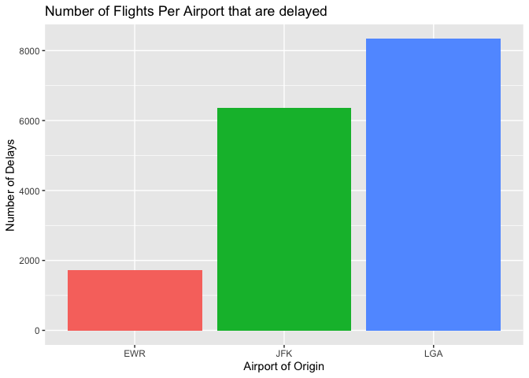
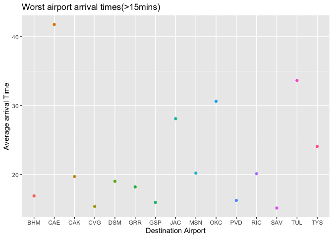

```r
library(nycflights13)
library(tidyverse)
```

```
## ── Attaching packages ─────────────────────────────────────── tidyverse 1.3.2 ──
## ✔ ggplot2 3.3.6     ✔ purrr   0.3.4
## ✔ tibble  3.1.8     ✔ dplyr   1.0.8
## ✔ tidyr   1.2.0     ✔ stringr 1.4.0
## ✔ readr   2.1.2     ✔ forcats 0.5.1
## ── Conflicts ────────────────────────────────────────── tidyverse_conflicts() ──
## ✖ dplyr::filter() masks stats::filter()
## ✖ dplyr::lag()    masks stats::lag()
```

```r
library(ggplot2)
library(lubridate)
```

```
## 
## Attaching package: 'lubridate'
## 
## The following objects are masked from 'package:base':
## 
##     date, intersect, setdiff, union
```

```r
library(readr)
library(tidyverse)
library(knitr)
library(downloader)
library(dplyr)
```


```r
?nycflights13
dat <- nycflights13::flights
head(dat)
```

```
## # A tibble: 6 × 19
##    year month   day dep_time sched_dep…¹ dep_d…² arr_t…³ sched…⁴ arr_d…⁵ carrier
##   <int> <int> <int>    <int>       <int>   <dbl>   <int>   <int>   <dbl> <chr>  
## 1  2013     1     1      517         515       2     830     819      11 UA     
## 2  2013     1     1      533         529       4     850     830      20 UA     
## 3  2013     1     1      542         540       2     923     850      33 AA     
## 4  2013     1     1      544         545      -1    1004    1022     -18 B6     
## 5  2013     1     1      554         600      -6     812     837     -25 DL     
## 6  2013     1     1      554         558      -4     740     728      12 UA     
## # … with 9 more variables: flight <int>, tailnum <chr>, origin <chr>,
## #   dest <chr>, air_time <dbl>, distance <dbl>, hour <dbl>, minute <dbl>,
## #   time_hour <dttm>, and abbreviated variable names ¹​sched_dep_time,
## #   ²​dep_delay, ³​arr_time, ⁴​sched_arr_time, ⁵​arr_delay
```


```r
delay <- dat %>%
  filter(carrier == "DL", arr_delay > 0) %>%
  group_by(origin) %>%
  count()
delay
```

```
## # A tibble: 3 × 2
## # Groups:   origin [3]
##   origin     n
##   <chr>  <int>
## 1 EWR     1725
## 2 JFK     6353
## 3 LGA     8335
```

```r
delta <- ggplot(data=delay, mapping=aes(origin, n, fill=origin)) +
  geom_bar(stat="identity", position="dodge") +
  labs(y = "Number of Delays",
       x = "Airport of Origin",
       title = "Number of Flights Per Airport that are delayed") +
  theme(legend.position = "none")
delta
```

<!-- -->
2. Which origin airport is best to minimize my chances of a late arrival when I am using Delta Airlines?
The airport with the fewest delays would be EWR or also known as Newark. Flying delta from this airport will minimize the chance of delay


```r
worst_arrival <- flights %>%
  group_by(dest) %>%
  summarise(avg_delaytime = mean(arr_delay, na.rm = TRUE)) %>%
  filter(avg_delaytime > 15)
worst_arrival
```

```
## # A tibble: 15 × 2
##    dest  avg_delaytime
##    <chr>         <dbl>
##  1 BHM            16.9
##  2 CAE            41.8
##  3 CAK            19.7
##  4 CVG            15.4
##  5 DSM            19.0
##  6 GRR            18.2
##  7 GSP            15.9
##  8 JAC            28.1
##  9 MSN            20.2
## 10 OKC            30.6
## 11 PVD            16.2
## 12 RIC            20.1
## 13 SAV            15.1
## 14 TUL            33.7
## 15 TYS            24.1
```

```r
worst <- ggplot(data=worst_arrival, mapping=aes(dest, avg_delaytime, color=dest)) +
  geom_point() +
  labs(y = "Average arrival Time",
       x = "Destination Airport",
       title = "Worst airport arrival times(>15mins)") +
  theme(legend.position = "none")
worst
```

<!-- -->
3. Which destination airport is the worst airport for arrival time?
From my observaion I have found that CAE or also known as Columbia metropolitan airport has the worst arrival times of any airport.


